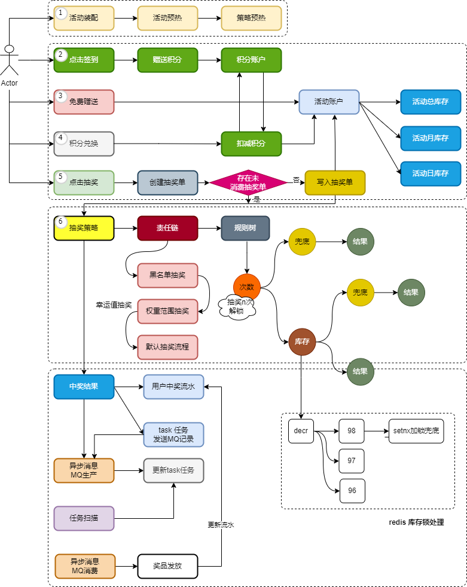

<h1 align="center">大营销平台系统</h1>

## 一、项目简介

大营销平台是一个访掘金抽奖系统，包含抽奖、活动、积分、返利、兑换等模块，主要实现了各类差异化抽奖流程，如：通用抽奖、黑名单抽奖、消耗N积分指定范围抽奖、抽奖N次解锁奖品等各类抽奖场景。

## 二、项目技术

项目使用 DDD 分层架构设计，基于 SpringBoot 进行开发，数据库使用 MySQL 和 Redis，并使用了 RabbitMQ、DB-Router、xxl-job 等技术。项目使用了多种设计模式，如模板模式、责任链模式、决策树模式、组合模式、工厂模式，提高代码的可重用、可扩展和可维护性，并对抽奖秒杀的流程设计进行优化，可以支撑单机2c2g服务器 100~200 TPS的吞吐量，抽奖接口响应时长 45~100 ms左右。

## 三、业务流程图

本项目的业务流程主要包括活动装配、点击签到、免费赠送、积分兑换、点击抽奖6个部分，业务流程图如下：

## 四、数据库ER图

本项目的数据库一共包括21张表，其中抽奖活动总月日账户、抽奖活动订单、用户中奖记录、用户行为返利订单、用户积分账户、用户抽奖订单等表进行了分库分表处理，提高数据库的查询效率，数据库表的ER图如下：

